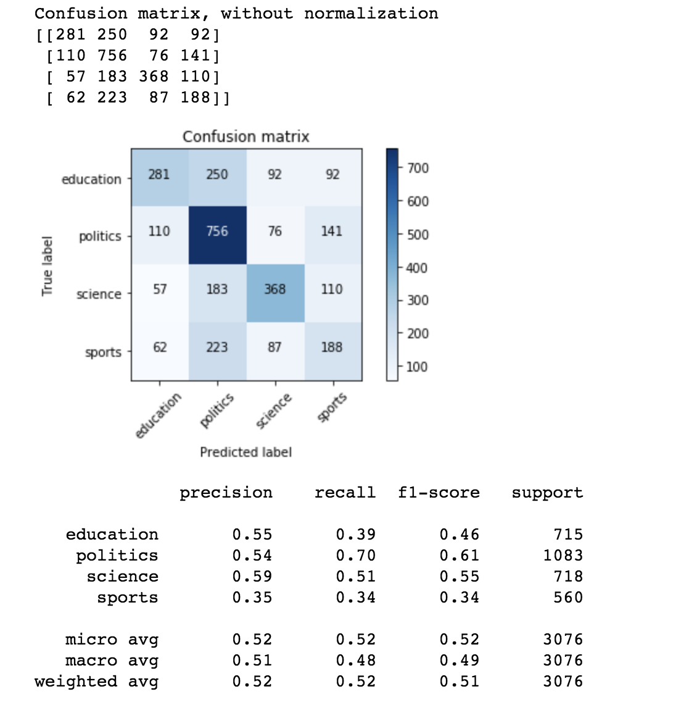
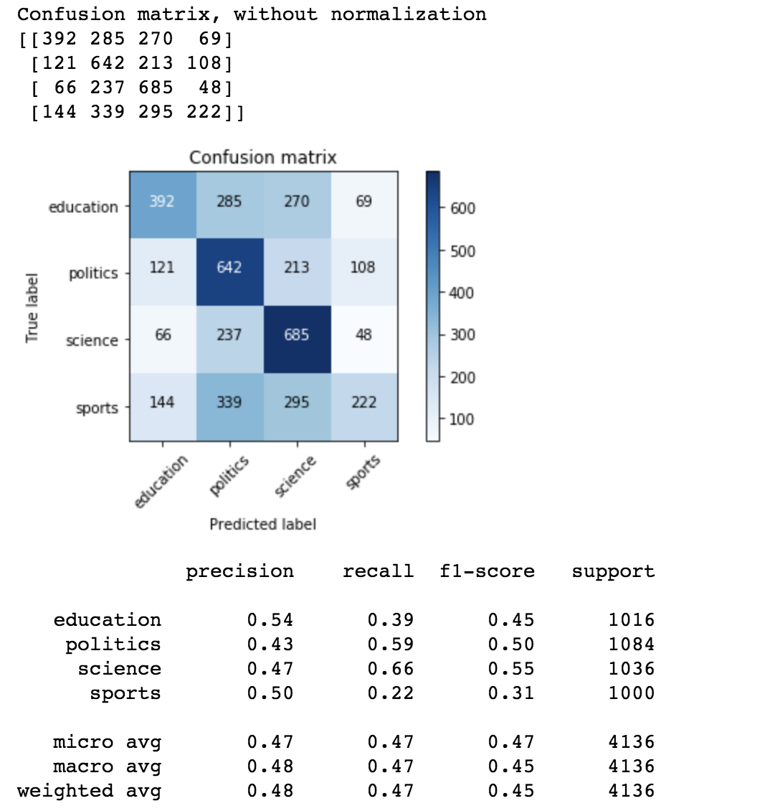
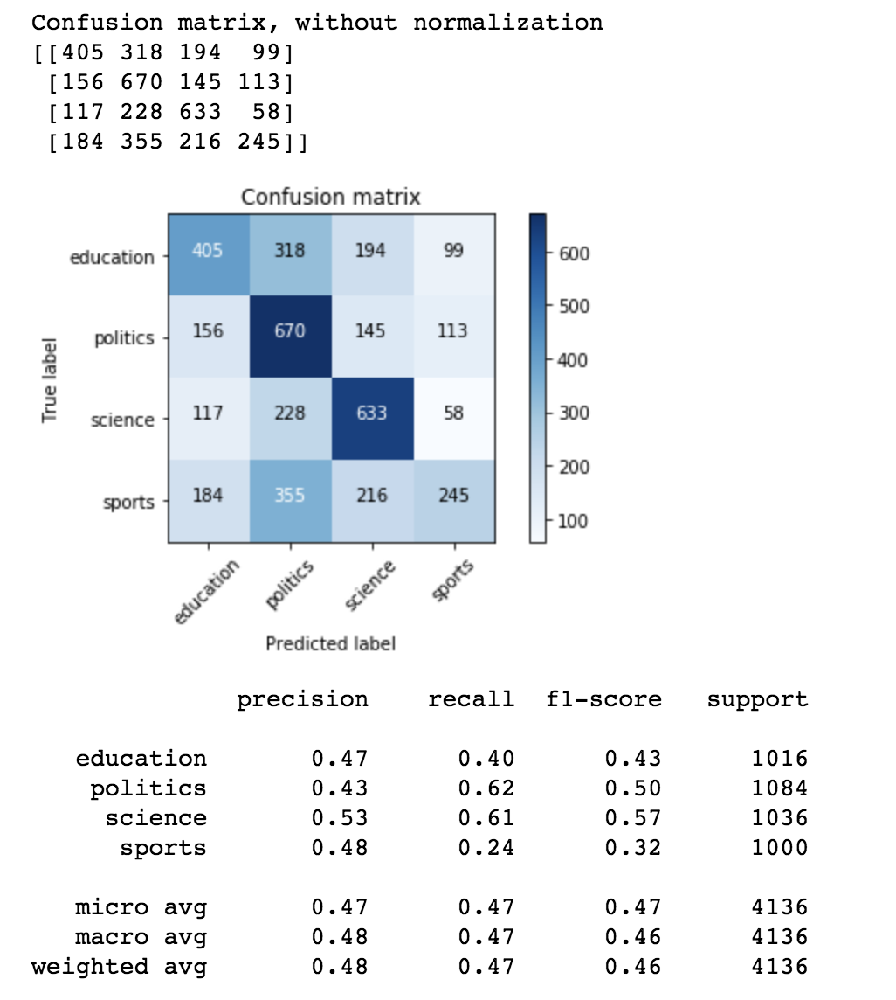
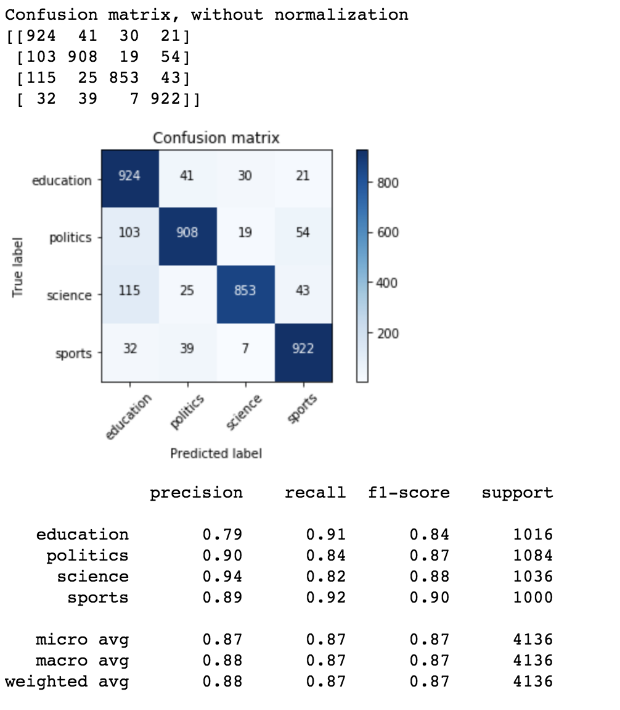
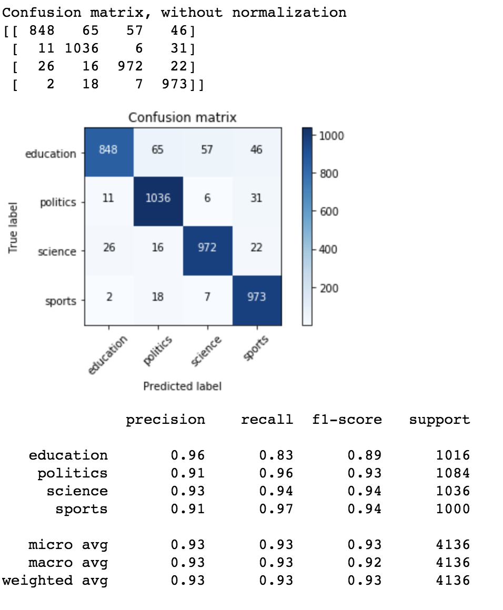
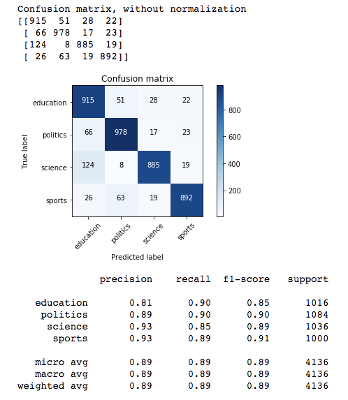
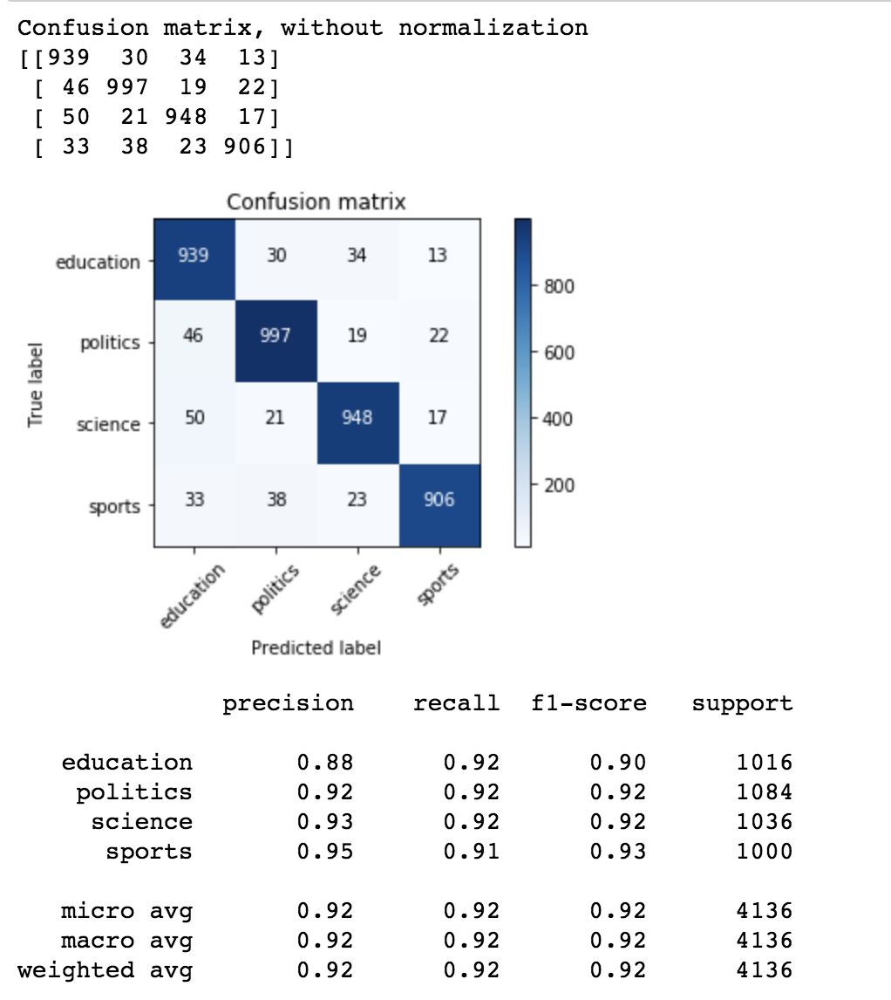
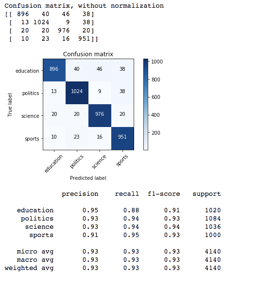

### Daily update

#### 11/15/2018

experiment 1

* RNN model with imbalance data
* potential problem
  * data is imbalanced
  * Glove 50d is directly used, which leads to many missing words.
    * Not sure about pros and cons of different dimensions of word2vec.
  * inappropriate model.
  * inappropriate methods for preprocessing data.

  

 

experiment 2

* Add more training data to deal with imblaced problem.



experiment 3

* retrain glove based on original glove vectors

  

Experiment 4

* I found **bug** in my code leads to poor performance!!!!!!!!!

* model

  ```python
  class RNN_tc(nn.Module):
      
      def __init__(self, input_size, hidden_size, output_size):
          super(RNN_tc, self).__init__()
          self.hidden_size = hidden_size
          
          self.i2h = nn.Linear(input_size + hidden_size, hidden_size)
          self.i2o = nn.Linear(input_size + hidden_size, output_size)
          self.softmax = nn.LogSoftmax(dim=1)
          
      def forward(self, input, hidden):
          combined = torch.cat((input, hidden), 1)
          hidden = self.i2h(combined)
          output = self.i2o(combined)
          output = self.softmax(output)
          return output, hidden
      
      def initHidden(self):
          return torch.zeros(1, self.hidden_size)
  ```

* potential improvements

  * retrain vectors based on existing train data
  * LSTM structure / CMM model
  * Mini-batch
    * why mini-batch
      * more stable result.
      * avoid local optimality
      * more efficient computation

  

experiment 5

* model

  ```python
  class RNN_tc(nn.Module):
      
      def __init__(self, input_size, hidden_size, output_size):
          super(RNN_tc, self).__init__()
          self.hidden_size = hidden_size
          
          self.rnn = nn.RNNCell(input_size, hidden_size, nonlinearity='relu')
          self.i2o = nn.Linear(hidden_size, output_size)
          self.softmax = nn.LogSoftmax(dim=1)
          
      def forward(self, input, hidden):
          hidden = self.rnn(input, hidden)
          output = self.i2o(hidden)
          output = self.softmax(output)
          return output, hidden
      
      def initHidden(self):
          return torch.zeros(1, self.hidden_size)
  ```

* result

  

#### 11/16/2018

experiment 1

* retrain word vector

* Model: rnn_tc_50d.11150316.pt

* potential improvement

  * retrain word vector using more training data

  

#### 11/17/2018

experiment 1

* Modify the model using minibatch. Although result is not as good as previous experiments, mini-batch saves a lot of time and garantee the stable loss value.

* model

  ```python
  class RNN_tc(nn.Module):
      
      def __init__(self, input_size, hidden_size, output_size):
          super(RNN_tc, self).__init__()
          self.num_layer = 1
          self.num_directions = 1
          
          self.hidden_size = hidden_size
          self.rnn = nn.RNN(input_size, hidden_size, batch_first=True)        
          self.i2o = nn.Linear(hidden_size, output_size)        
          self.softmax = nn.LogSoftmax(dim=1)
          
      def forward(self, input, hidden):
          output, hidden = self.rnn(input, hidden)     
          output = self.i2o(output[:, -1, :])     
          output = self.softmax(output)   
          return output, hidden
      
      def initHidden(self, batch_size):
          return torch.zeros(self.num_layer*self.num_directions ,batch_size, self.hidden_size)
  ```

* result

  

#### 11/18/2018

* Use LSTM

* model

  ```python
  class RNN_tc(nn.Module):
      
      def __init__(self, input_size, hidden_size, output_size):
          super(RNN_tc, self).__init__()
          self.num_layer = 1
          self.num_directions = 1
          
          self.hidden_size = hidden_size
  #         self.rnn = nn.RNN(input_size, hidden_size, batch_first=True)        
          self.rnn = nn.LSTM(input_size, hidden_size, batch_first=True)
          self.i2o = nn.Linear(hidden_size, output_size)        
          self.softmax = nn.LogSoftmax(dim=1)
          
      def forward(self, input, hidden, cn):
          output, (hidden, cn) = self.rnn(input, (hidden, cn))     
          output = self.i2o(output[:, -1, :])     
          output = self.softmax(output)   
          return output, (hidden, cn)
      
      def initHidden(self, batch_size):
          return torch.zeros(self.num_layer*self.num_directions, batch_size, self.hidden_size)
      
      def initState(self, batch_size):
          return torch.zeros(self.num_layer*self.num_directions, batch_size, self.hidden_size)
  ```

* result

  

#### 11/19/2018

experiment 1

* TextCNN model

* model

* ```python
  class CNN(nn.Module):
      def __init__(self, seq_length ,embedding_size, filter_sizes, num_filter, fc_input_size, n_class):
          super(CNN, self).__init__()
          self.num_filter = num_filter
          self.filter_sizes = filter_sizes
          self.embedding_size = embedding_size
          self.num_filters_total = len(self.filter_sizes) * num_filter
          
          self.in_channel = 1
          self.out_channel = 2
  
          self.convs = []
          self.pools = []
          for filter_size in filter_sizes:            
              self.convs.append(nn.Conv2d(self.in_channel, self.out_channel, (filter_size, embedding_size)))
              self.pools.append(nn.MaxPool2d((seq_length-filter_size+1, 1), stride=1))
          
          self.fc = nn.Linear(fc_input_size, n_class)
  #         self.fc = nn.Linear(8, 100)
          self.relu = nn.ReLU()
          self.softmax = nn.LogSoftmax()
          print(self.fc)
          
      def forward(self, input):
  #         print(input.size())
          pooled_inputs = []
          for conv, pool in zip(self.convs, self.pools):
              conved_input = conv(input)
              pooled_input = pool(conved_input)
              pooled_inputs.append(pooled_input)
          output = torch.cat(pooled_inputs, 3)
          output = torch.reshape(output, (-1, self.num_filters_total))       
          output = self.fc(output)
          output = self.relu(output)
          output = self.softmax(output)
          return output
  ```

* poor result

* potential problem and improvements

  * bad CNN structure
  * adjust CNN structure
    * more layer
    * batchNorm